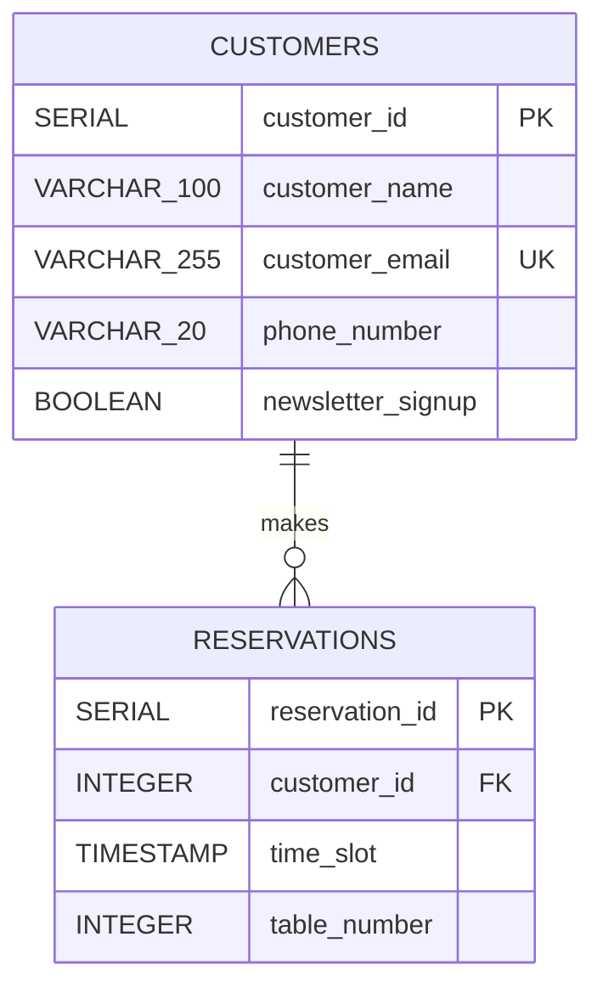

# Cafe Fausse -- Entity Diagram (ED)

## Purpose

This entity diagram represents the two entities required by SRS FR-17 and the relationship between them. It is a logical view of the PostgreSQL schema in `schema.sql`; it does not add entities or attributes beyond the approved requirements.

## Relationship interpretation

- One **customer** can make zero, one, or many **reservations**.
- Each **reservation** belongs to exactly one **customer**.
- `reservations.customer_id` is a foreign key to `customers.customer_id`.
- Deleting a customer cascades to that customer's reservations, as defined in the development/demo schema.
- A reservation is additionally unique by the pair `(time_slot, table_number)`, preventing the same table from being booked twice in one time slot.

See [data_dictionary.md](data_dictionary.md) for the detailed meaning and constraints of every attribute.
