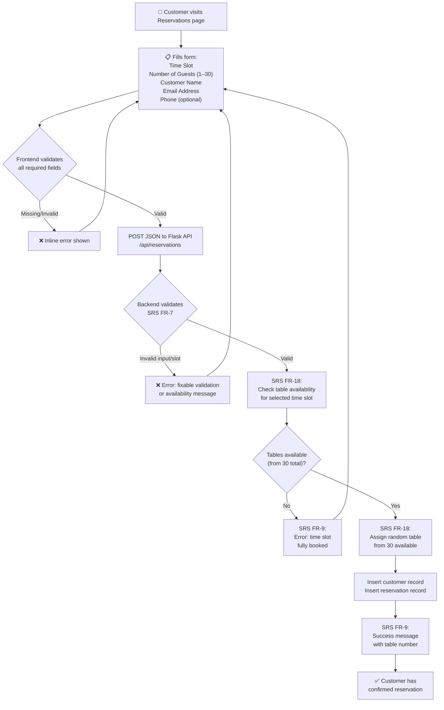
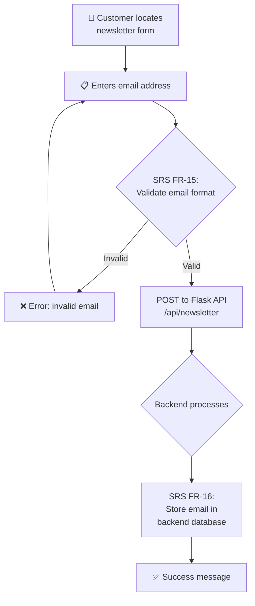
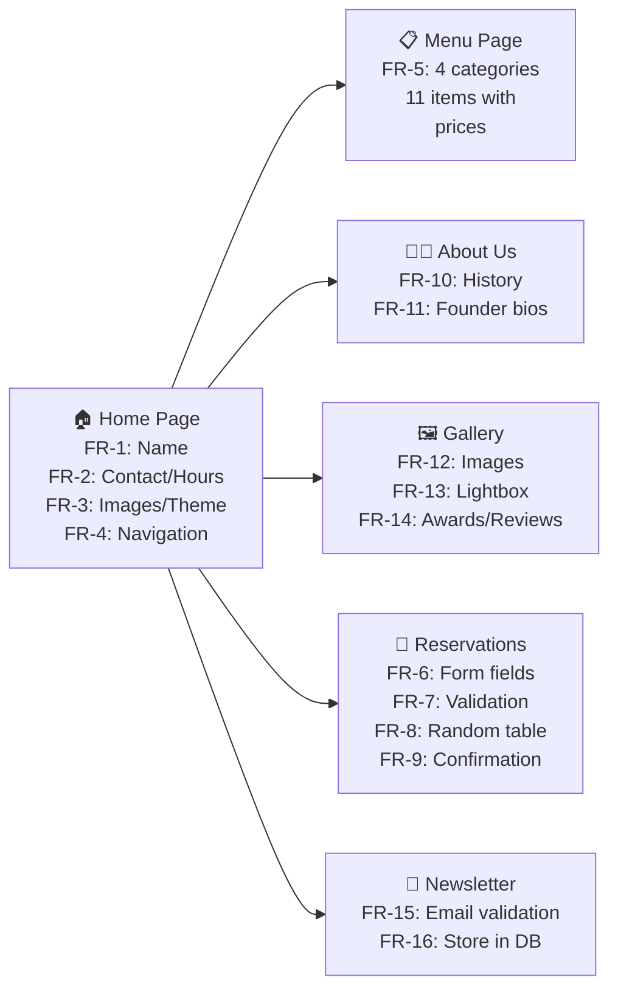
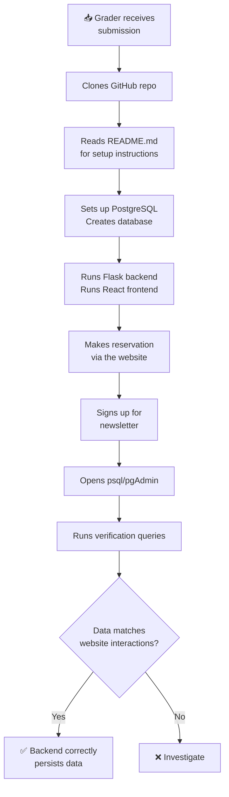

# Café Fausse — User Journey Maps

> **Authority:** All journeys are grounded in the SRS functional requirements.

---

## 1. Reservation Journey (SRS FR-6, FR-7, FR-8, FR-9, FR-18)

---

## 2. Newsletter Journey (SRS FR-15, FR-16)

---

## 3. Full Site Browsing Journey (SRS FR-1 through FR-14)

---

## 4. Grader Verification Journey (SRS §4)

